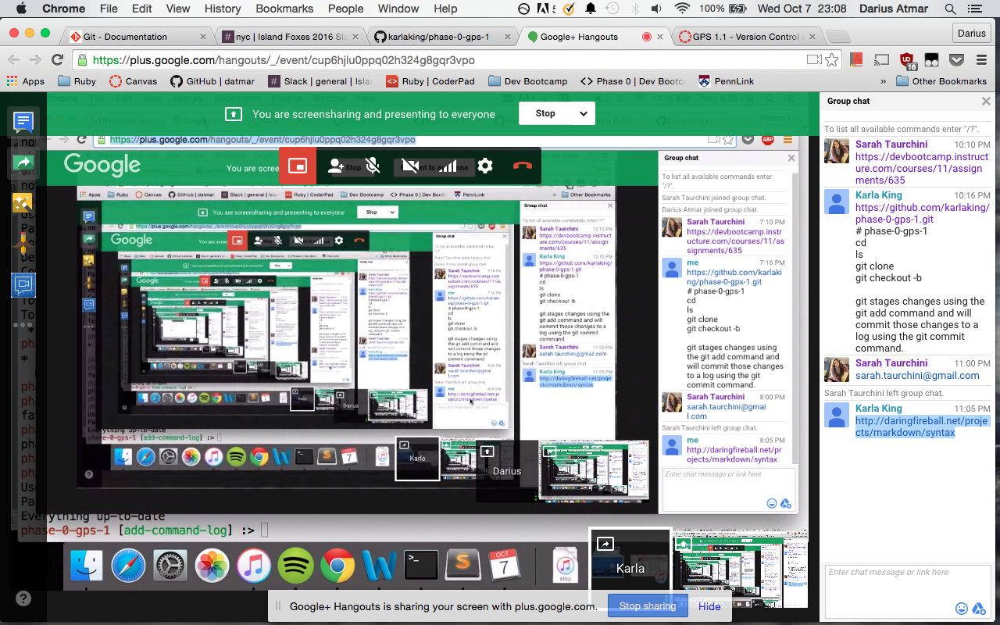

*# phase-0-gps-1*
**cd**
ls
git clone
git checkout -b

git stages changes using the git add command and will commit those changes to a log using the git commit command

```
x = 5
y = 5 + x
```

[Markdown Syntax](http://daringfireball.net/projects/markdown/syntax)

